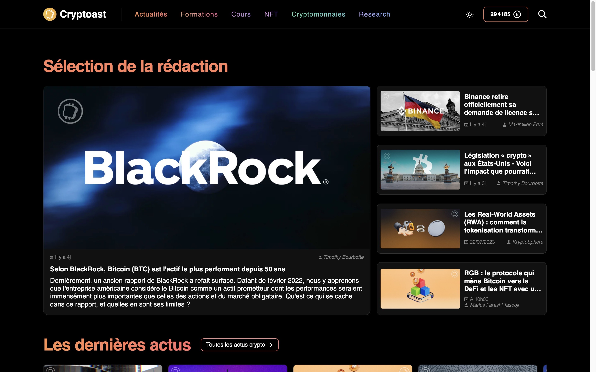
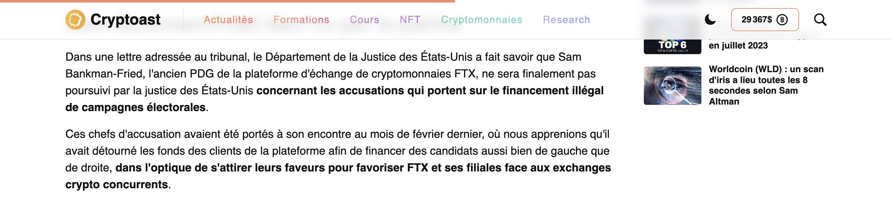
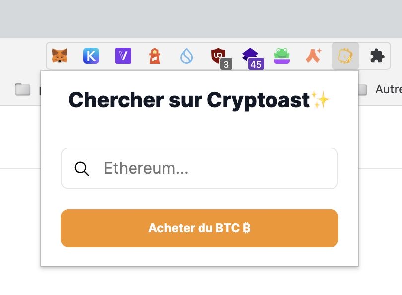
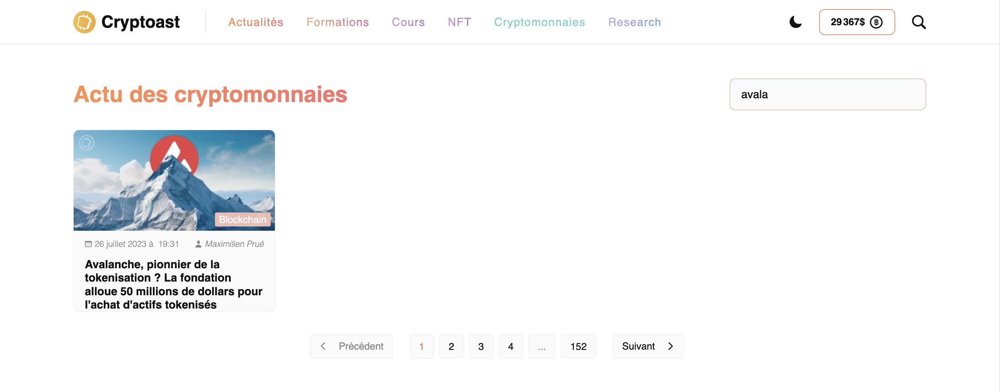

# Better Cryptoast ✨

## Description: 

Enhance your browsing experience on Cryptoast.fr with the Better Cryptoast extension.

1. **Live Bitcoin Price:** Stay updated with the latest Bitcoin price. This extension fetches real-time Bitcoin price in USD from Coingecko and displays it in the header, allowing you to keep an eye on Bitcoin's value without the need to navigate away from your current page.

2. **Image Replacer & Enhancer:** Optimize your visual experience on the site. The extension replaces specific images on the page with more optimized versions, offering uncompressed, better-quality images.

3. **Reading Progress Indicator:** Enjoy a streamlined reading experience with our easy-to-use progress bar. As you scroll through articles (containing the class `article-main-ctn`), a progress bar at the top of the page fills up, indicating how much of the page you've scrolled through.

4. **In-Built Search Feature:** The extension's popup features a built-in search field that allows you to search for content directly on Cryptoast. Find what you need without leaving your current page, improving efficiency and saving time.

5. **On-Page Search Bar:** A new addition to the actualité page is a real-time search bar that filters articles based on your keyword inputs. As you type, articles that don't match your query are hidden, helping you find relevant content more quickly.

6. **Bug Fixes:** Better Cryptoast offers a more consistent and reliable user experience by fixing various bugs. This includes issues like stretched-out thumbnails, the website not working in windowed mode, and instances of text not being visible. The extension smoothens your browsing experience by tackling these issues head-on.

7. **Block Slow Scripts:** For a faster and more private browsing experience, the extension blocks slow and unnecessary scripts, including redundant JavaScript and scripts used for cookie tracking.

8. **Automatic Theme Detection & Enhanced Styles:** Better Cryptoast automatically detects your preferred theme (dark or light) and adjusts the website's interface accordingly. It also introduces additional CSS for an enhanced, visually pleasing user experience.

Upgrade your Cryptoast.fr browsing experience today with the Better Cryptoast extension - making your reading more efficient, engaging, and free from distractions.
